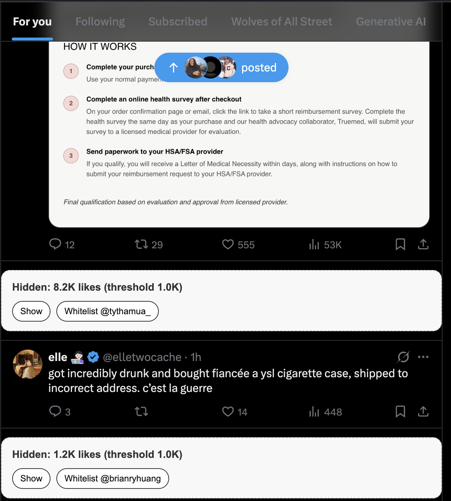

# X Like Threshold Filter

Hide X posts above a like threshold with a whitelist for specific handles.

## Features
- Hide posts with likes greater than your threshold (default: 1000)
- Whitelist handles to always show
- Enable/disable toggle
- Works on infinite scroll
- Placeholder with Show/Whitelist buttons

## Install (Chrome)
### Option A: From GitHub (ZIP)
1. Go to `https://github.com/RandyVentures/x-like-threshold-filter-plugin`.
2. Click **Code** → **Download ZIP**.
3. Unzip the download.
4. Open `chrome://extensions`.
5. Enable Developer mode.
6. Click "Load unpacked" and select the unzipped `x-like-threshold-filter-plugin` folder.
7. Visit `https://x.com`.

### Option B: From a local clone
1. Clone the repo to your machine:
   ```bash
   git clone https://github.com/RandyVentures/x-like-threshold-filter-plugin.git
   ```
2. Open `chrome://extensions`.
3. Enable Developer mode.
4. Click "Load unpacked" and select the cloned `x-like-threshold-filter-plugin/` folder.
5. Visit `https://x.com`.

## Usage
- Open the extension popup to toggle enabled state, set the threshold, and manage the whitelist.
- Hidden posts show a placeholder with "Show" and "Whitelist" actions.




## Development
- Content script: `x-like-threshold-filter/src/content.js`
- Popup UI: `x-like-threshold-filter/src/popup.html`
- Like parser: `x-like-threshold-filter/src/like_parser.js`

## Tests
```bash
node tests/parseLikeCount.test.js
```

## Safari (Phase 2)
Convert with Xcode's "Safari Web Extension" tooling once the Chrome build is stable.
